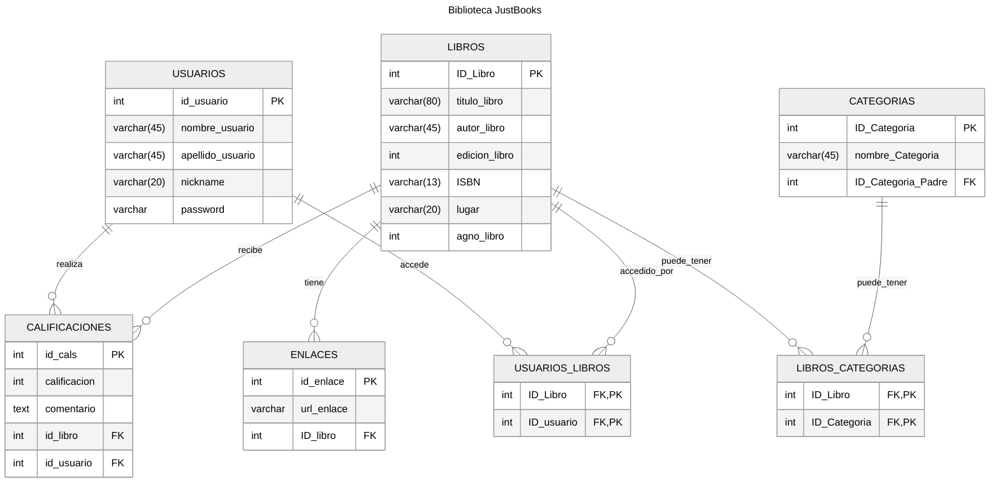

```mermaid
---
title: Biblioteca JustBooks
---
%%{init: {'theme':'neutral'}}%%
erDiagram
    LIBROS {
	    int ID_Libro PK
	    varchar(80) titulo_libro
	    varchar(45) autor_libro
	    int edicion_libro
	    varchar(13) ISBN
	    varchar(20) lugar
	    int agno_libro
    }

    USUARIOS {
	    int id_usuario PK
	    varchar(45) nombre_usuario
	    varchar(45) apellido_usuario
	    varchar(20) nickname
	    varchar password
    }

USUARIOS ||--o{ CALIFICACIONES : realiza

LIBROS ||--o{ CALIFICACIONES : recibe
    CALIFICACIONES {
	    int id_cals PK
		int calificacion
		text comentario
		int id_libro FK
		int id_usuario FK
	    
    }

LIBROS ||--o{ ENLACES : tiene
    ENLACES {
	    int id_enlace PK
		varchar url_enlace
	    int ID_libro FK
    }

LIBROS_CATEGORIAS { 
	int ID_Libro FK,PK 
	int ID_Categoria FK,PK
}


USUARIOS_LIBROS  {
	int ID_Libro FK,PK
	int ID_usuario FK,PK
}

USUARIOS ||--o{ USUARIOS_LIBROS : accede
LIBROS ||--o{ USUARIOS_LIBROS : accedido_por

LIBROS ||--o{ LIBROS_CATEGORIAS: puede_tener
CATEGORIAS ||--o{ LIBROS_CATEGORIAS: puede_tener

    CATEGORIAS {
	    int ID_Categoria PK
	    varchar(45) nombre_Categoria
	    int ID_Categoria_Padre FK
    }
    
```
